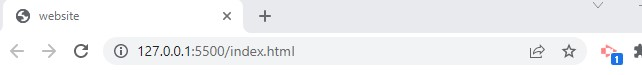
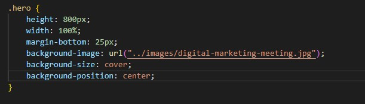
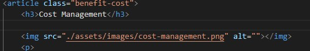
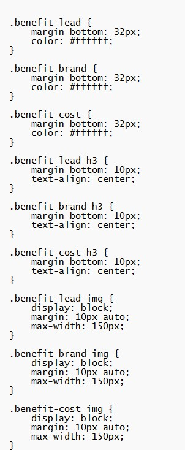

# Code Refactor Starter Code

# Apply title header and nav to the webpage

- Use header element and nav element instead of div.
- Correct style.css to match new elements.

# Refactor body

- Use section element instead of div.
- Use img element instead of background image so alt tag can be added.
- Remove image background from style.css and add image element to hero class.

- Use section and article elements.
- Add id to search-engine-optimization to link to navigating bar.
- Add alt tag for decorative image.
- Remove closing image tag

- Add new class "benefit-detail" to replace benefit-lead, benefit-brand, and benefit-cost since they all have the same value.

- Add "benefit-detail" class to style.css 
- Remove benefit-lead, benefit-brand, and benefit-cost from style.css

# Refactor footer

- Use footer element instead to div.
- Add a new line for privacy link for future usage. 
- Add color to privacy link in style.css

# Deployment

To deploy this project go to https://moniquemeas.github.io/HoriseonMarketing/

